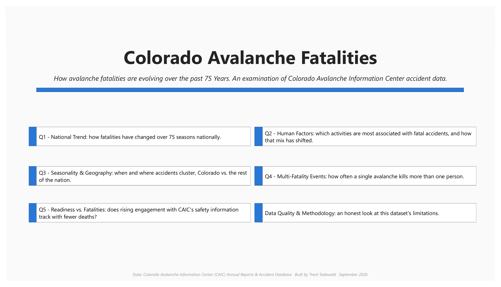
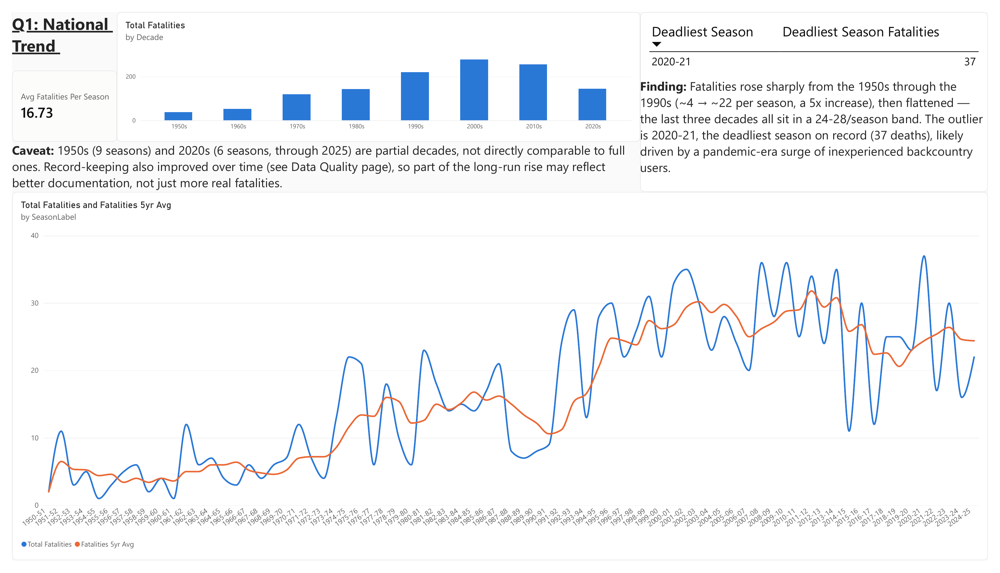
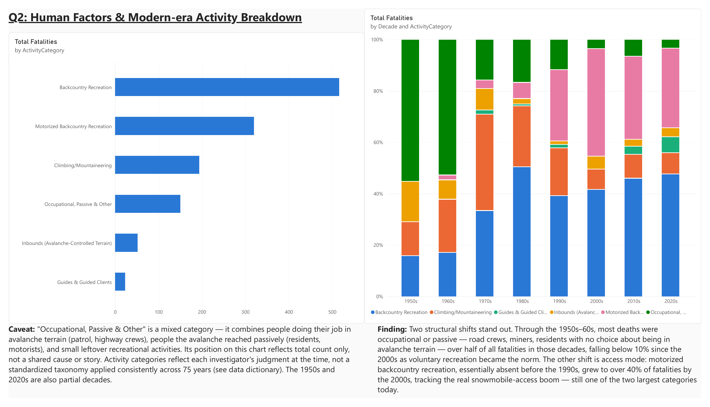
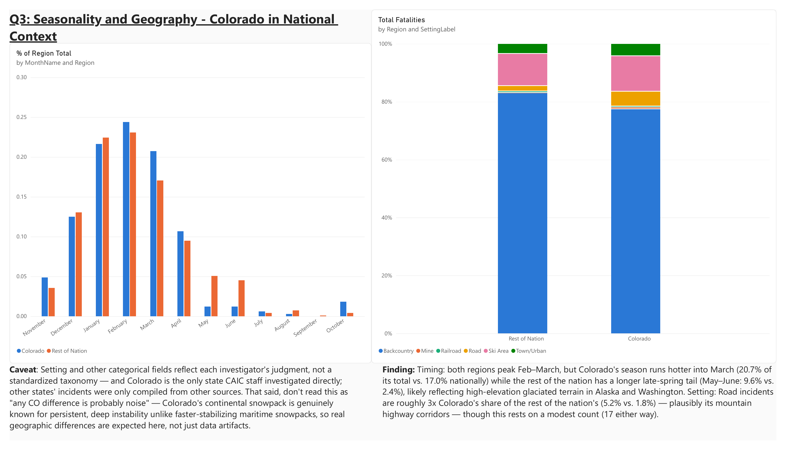
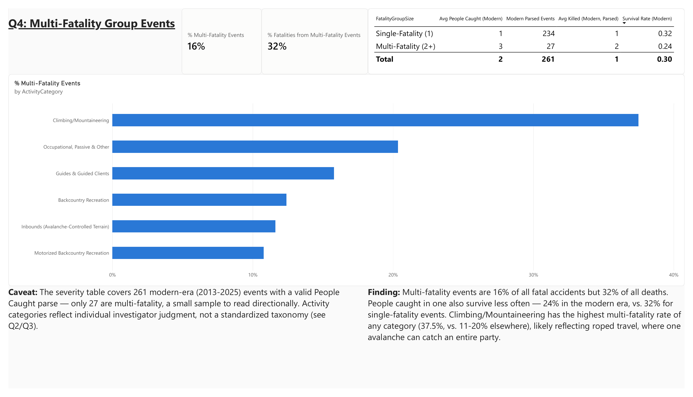
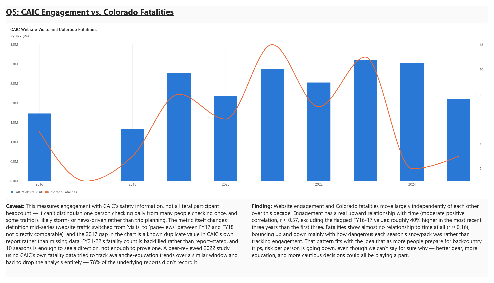
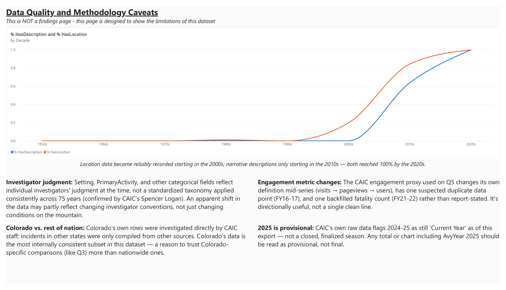

# Colorado Avalanche Fatalities Dashboard

How avalanche fatalities in Colorado and nationally have evolved over 75
years, built entirely from the Colorado Avalanche Information Center's (CAIC)
own accident records and annual reports.

This is Project 2 of a data analyst portfolio (see Project 1 for a cleaner,
more conventional dataset). This one was chosen deliberately for the opposite
reason: it's messy. The source data spans 75 seasons of manual investigator
notes, changing record-keeping standards, inconsistent categorical fields,
and a hand-assembled secondary dataset with its own quirks. Working through
that mess honestly, flagging what's uncertain instead of smoothing over it,
is as much the point of this project as any individual finding.

## The question behind the project

Backcountry gear, avalanche forecasting, and avalanche education have all
improved over the last decade. Has that translated into fewer deaths? That
question is what started this project, and it turned out to be harder to
answer than expected: no clean, public dataset of backcountry participation
or safety-equipment/education adoption exists (see Q5 below). What this
dashboard can do instead is the next best thing: use CAIC's own
website-engagement numbers as a proxy for how many people are preparing
before a trip, and compare that against Colorado's own fatality trend.

## Dashboard preview

**Overview**


**Q1: National Trend**


**Q2: Human Factors**


**Q3: Seasonality & Geography**


**Q4: Multi-Fatality Events**


**Q5: Readiness vs. Fatalities**


**Data Quality and Methodology**


## The five questions

Every page in this dashboard traces back to one of five questions. A sixth
page, **Data Quality and Methodology**, isn't a findings page at all; it's
an honesty page that qualifies the other five, which is why it isn't numbered.

| Page | Question | Headline finding |
|---|---|---|
| **Q1**: National Trend | How have avalanche fatalities changed nationally over the last 75 seasons? | Fatalities rose sharply from the 1950s through the 1990s (~4→22 per season, 5x), then flattened; the last three decades all sit in a 24-28/season band. The outlier: 2020-21, the deadliest season on record (37 deaths), plausibly a pandemic-era surge of inexperienced backcountry users. |
| **Q2**: Human Factors | What activities are most associated with fatal accidents, and has that mix changed over 75 years? | Two structural shifts: occupational/passive exposure collapsed (55%→under 10% since the 2000s), while motorized backcountry recreation rose from ~0% to over 40%, tracking the real snowmobile-access boom. |
| **Q3**: Seasonality & Geography | When and where do fatal accidents cluster, and how does Colorado compare to the rest of the nation? | Both regions peak Feb-March, but Colorado runs hotter into March; the rest of the nation has a longer late-spring tail. Road incidents are ~3x more common, share-wise, in Colorado. |
| **Q4**: Multi-Fatality Events | How often does a single avalanche kill more than one person? | Multi-fatality events are 16% of all accidents but 32% of all deaths. Climbing/Mountaineering has by far the highest multi-fatality rate (37.5% vs. 11-20% elsewhere), plausibly reflecting roped travel. |
| **Q5**: Readiness vs. Fatalities | Does rising engagement with CAIC's safety information track with fewer deaths? | Engagement has a real upward trend (r≈0.57), up ~40% over the decade, while fatalities show almost no trend at all (r≈0.16), moving mostly with each season's snowpack danger instead. Consistent with declining risk-per-person, but not proof of it. |
| **Appendix**: Data Quality & Methodology | How has the record-keeping itself changed, and what does that mean for how much weight the findings above can bear? | Location data became reliable starting in the 2000s; narrative descriptions only from the 2010s. Investigator judgment, not a standardized taxonomy, drives most categorical fields. |

Full write-ups, including caveats, build notes, and every named number's
source, live in [`docs/research_questions.md`](docs/research_questions.md)
(also available as a formatted [`.docx`](docs/research_questions.docx)).

## Data

- **CAIC accident database**: 1,016 fatal avalanche events, 1951-2025,
  nationwide. See [`docs/fact_table_data_dictionary.md`](docs/fact_table_data_dictionary.md).
- **CAIC engagement proxy**: website/app usage figures, FY2015-16 through
  FY2024-25, hand-transcribed from ten years of CAIC's own annual report
  PDFs (six of them only recoverable via the Wayback Machine). See
  [`docs/caic_engagement_data_dictionary.md`](docs/caic_engagement_data_dictionary.md)
  and [`data/processed/source_pdfs.csv`](data/processed/source_pdfs.csv) for
  the exact source and retrieval method behind every value.
- Categorical dimension tables (`ActivityCategory`, `Month`) built and
  documented separately; see
  [`docs/activity_category_data_dictionary.md`](docs/activity_category_data_dictionary.md)
  and [`docs/month_dimension_data_dictionary.md`](docs/month_dimension_data_dictionary.md).
- One data-quality question was resolved by reaching out directly to CAIC
  staff; see [`docs/caic_setting_codes_email.md`](docs/caic_setting_codes_email.md).

**Citation:** Colorado Avalanche Information Center, Accident Database and
Annual Reports (FY2015-16 through FY2024-25). Compiled and processed for
this project, 2026.

## Methodology

- **Power BI + DAX** for the data model and every visual.
- **Python** for any transformation that needed judgment or validation
  rather than a purely mechanical rule (e.g., collapsing 24 raw activity
  values into 6 categories, mapping months to season order, assembling the
  engagement dataset from ten separate PDFs). Purely mechanical
  transformations (a binary Colorado/not-Colorado split, a single-vs-multi
  fatality relabel) were built directly as DAX calculated columns instead;
  see the `data/processed/build_*.py` scripts for the former.
- **Every computed statistic was cross-checked independently in Python**
  against the source CSV before being written up as a finding. This
  caught real errors twice during this project (see below), which is
  exactly why the habit exists.

## Data quality, by design

This dataset is not clean, and the dashboard doesn't pretend otherwise. A
few examples documented in full in the data dictionaries:

- Categorical fields (`Setting`, `PrimaryActivity`) reflect individual
  investigators' judgment over 75 years, not a standardized taxonomy,
  confirmed directly with CAIC staff.
- The engagement dataset's website metric changes definition mid-series
  (`visits` → `pageviews`), and one year (FY16-17) is a known duplicate
  value in CAIC's own report, flagged rather than guessed at or dropped.
- One year's fatality count (FY21-22) is backfilled from the accident
  database because that year's report never states one in prose.

## Bugs caught along the way

Two genuinely subtle issues came up while building this, both worth
recording since they're easy to hit again in other projects:

1. **A column imported with the wrong data type stayed invisible until a
   specific kind of query touched it.** `AvyYear` came in as Text instead
   of Whole Number: every existing chart worked fine until a new measure
   did a direct numeric comparison against it, which threw a DAX type
   error. Fixed by correcting the column's data type in Power BI's Data
   view.
2. **A `DIVIDE` measure that should equal exactly `0` for a decade with
   zero matching rows instead returned `BLANK()`, silently dropping that
   entire category from a chart.** Power BI's `SUMMARIZECOLUMNS` engine can
   do this when a `CALCULATE` filter and the visual's grouping column sit
   on the same table. Fixed by appending `+ 0` to the measure, coercing the
   blank back to a real zero.

Both are written up in full, with the exact symptoms and diagnostic steps,
in [`docs/fact_table_data_dictionary.md`](docs/fact_table_data_dictionary.md).

## Repo structure

```
data/
  raw/                  original CAIC export (unmodified)
  processed/            cleaned fact table, dimension tables, engagement
                         dataset, and the Python scripts that built them
docs/
  research_questions.md the full write-up: questions, findings, caveats,
                         build notes (also as research_questions.docx)
  *_data_dictionary.md  one per table: columns, sources, caveats
  caic_setting_codes_email.md   correspondence with CAIC staff
  build/                script that generates the .docx from the .md
  screenshots/          one PNG per dashboard page, used above
design/
  avalanche_dashboard_theme.json   Power BI theme file (colorblind-checked
                                   categorical palette)
```

The `.pbix` file itself isn't in this repo yet; see below.

## Viewing this project

**[Live dashboard](https://app.powerbi.com/view?r=eyJrIjoiODVlOTQyN2UtNzk3Ny00MTBjLTlhNDctYTk4OWQ5YjNkMDk4IiwidCI6IjdjODEzYjU2LWNlNTctNDdlZS04NjE5LTZlZGU1YzU3OGZjMyJ9)**,
published via Power BI's Publish to Web, no sign-in required. The `.pbix`
file itself isn't in this repo yet (see **Repo structure** above); the
published link is the primary way to view the report for now.

## Author

Trent Tadewald
